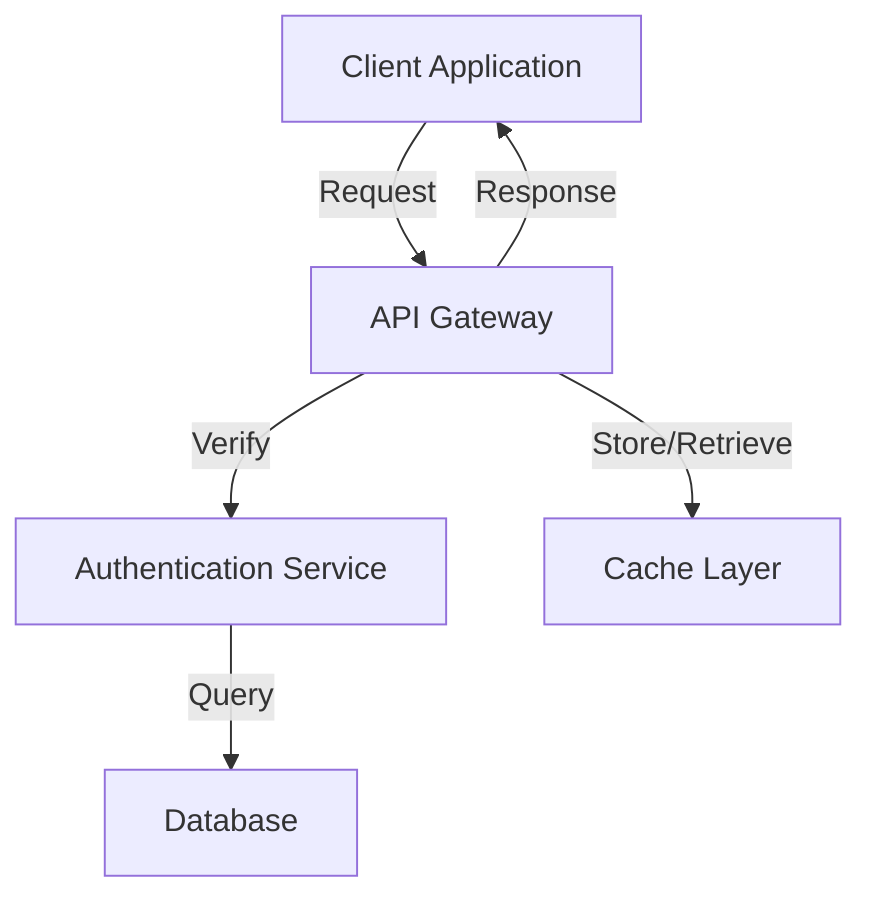
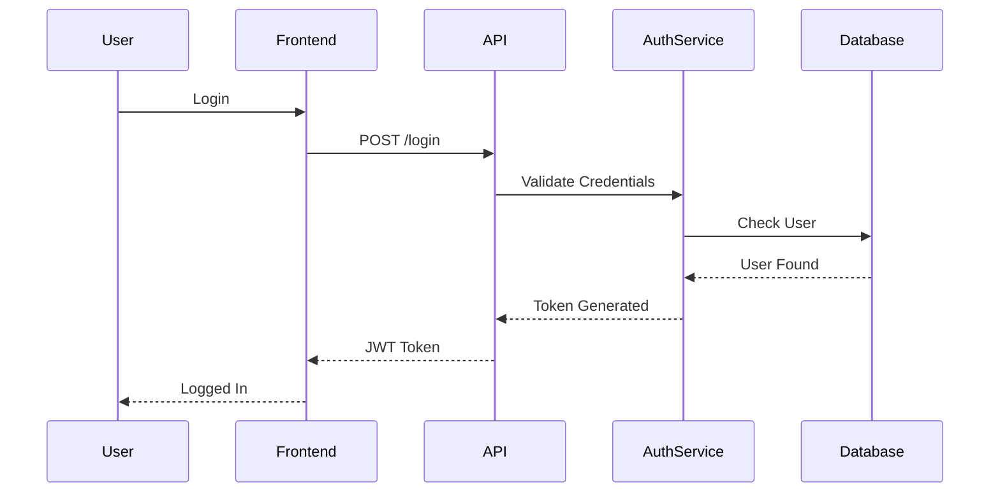
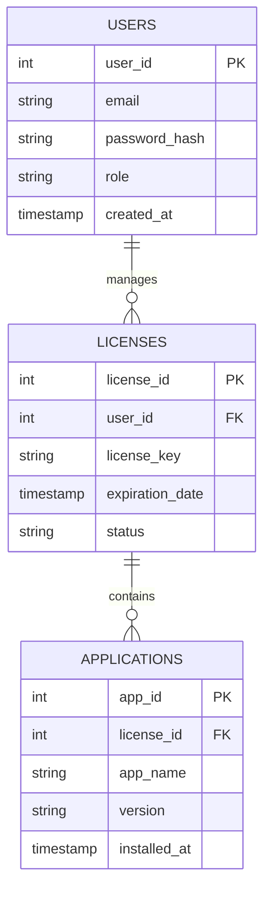
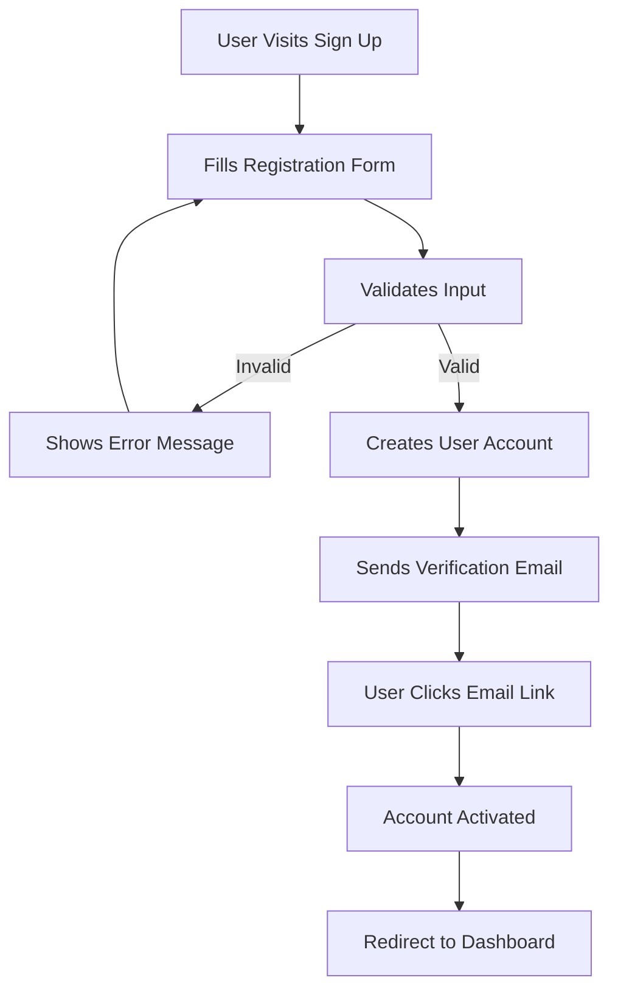
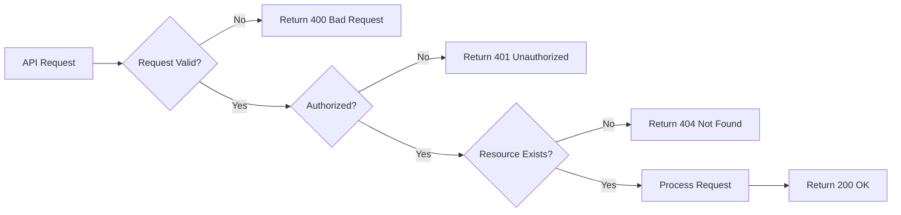
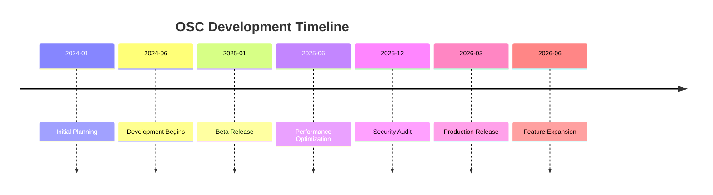

# Interactive Features

This section demonstrates the interactive elements available in the OSC documentation to enhance your understanding of the system.

## Diagrams with Mermaid

Mermaid.js allows you to create various types of diagrams directly in your documentation.

### System Architecture Flow



### User Authentication Flow



### Database Schema



## Code Examples

### API Request Example

```javascript
// Example: Getting user profile
const response = await fetch('/api/users/profile', {
  method: 'GET',
  headers: {
    'Authorization': 'Bearer YOUR_API_KEY',
    'Content-Type': 'application/json'
  }
});

const user = await response.json();
console.log(user);
```

### React Component Example

```tsx
import React, { useState, useEffect } from 'react';

export function UserProfile() {
  const [user, setUser] = useState(null);
  const [loading, setLoading] = useState(true);

  useEffect(() => {
    fetchUserProfile();
  }, []);

  const fetchUserProfile = async () => {
    try {
      const response = await fetch('/api/users/profile');
      const data = await response.json();
      setUser(data);
    } catch (error) {
      console.error('Error fetching profile:', error);
    } finally {
      setLoading(false);
    }
  };

  if (loading) return <div>Loading...</div>;
  return (
    <div>
      <h1>{user?.name}</h1>
      <p>{user?.email}</p>
    </div>
  );
}
```

### SQL Query Example

```sql
-- Get active licenses expiring within 30 days
SELECT 
  u.email,
  l.license_key,
  l.expiration_date,
  DATEDIFF(day, GETDATE(), l.expiration_date) as days_until_expiry
FROM users u
JOIN licenses l ON u.user_id = l.user_id
WHERE l.status = 'ACTIVE'
  AND l.expiration_date BETWEEN GETDATE() AND DATEADD(day, 30, GETDATE())
ORDER BY l.expiration_date ASC;
```

## Interactive Callouts

:::info
This is informational content. Use this to provide helpful context and additional information.
:::

:::warning
This indicates a warning. Use this for important precautions and potential issues to watch out for.
:::

:::danger
This indicates critical information. Use this for breaking changes or critical issues.
:::

:::tip
This is a helpful tip. Use this for best practices and recommendations.
:::

## Process Workflows

### User Registration Workflow



### API Error Handling



## Timeline



## Tips for Using Interactive Features

### Best Practices

- **Diagrams**: Use for system architecture, workflows, and data relationships
- **Code Examples**: Always provide realistic, runnable examples
- **Callouts**: Use consistently for warnings, tips, and important information
- **Sequences**: Use for authentication flows, API interactions, and user journeys

### When to Use Each Feature

| Feature | Use Case | Example |
|---------|----------|---------|
| Mermaid Diagram | System architecture, flows | API flow, database schema |
| Code Block | Implementation details | API requests, code snippets |
| Callout | Important information | Warnings, tips, best practices |
| Sequence Diagram | Interaction between systems | Authentication flow, API call sequence |

## Embedding External Content (Optional)

You can also embed:

- **YouTube Videos**: For video tutorials
- **CodePen/CodeSandbox**: For interactive code examples
- **Google Docs**: For collaborative documentation
- **External Diagrams**: From draw.io or similar tools

Example:
- [OSC Flow Diagram](https://viewer.diagrams.net/?tags=%7B%7D&lightbox=1&highlight=0000ff&edit=_blank&layers=1&nav=1&dark=auto#G1XCR583xwiXVDsWGLS1hx5Pb46mKkqRu5)

## Next Steps

- Explore other documentation sections
- Try creating your own diagrams
- Refer back to code examples
- Use the glossary for terminology
