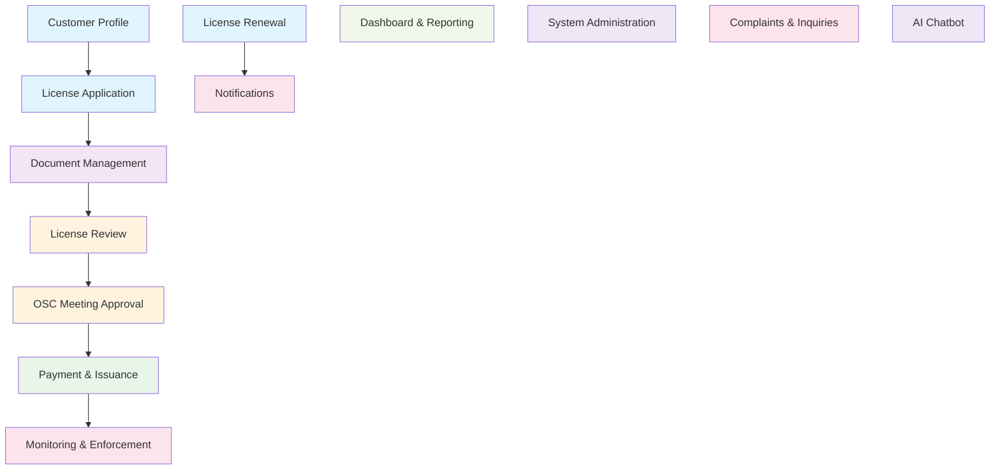
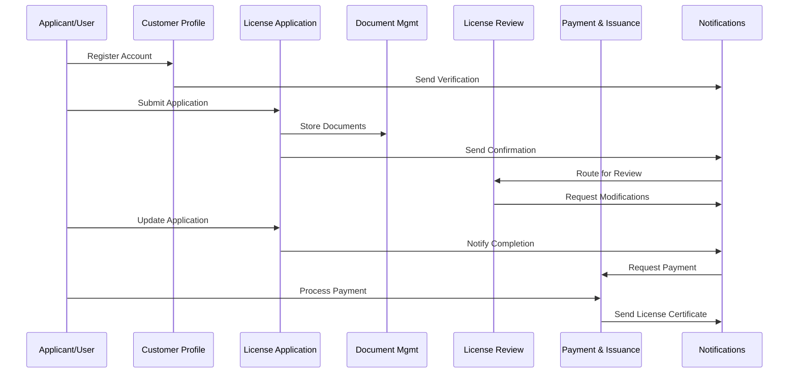

# Functional Modules

The OSC system achieves its comprehensive licensing and permitting objectives through 13 interconnected functional modules working together in a seamless ecosystem. Each module handles specific business processes while integrating with others to provide complete end-to-end functionality.

## Module Overview

The system's architecture is built on these core modules:

---

## 1. Modul Profil Pelanggan (Customer Profile)

**Purpose**: Manages applicant account registration and identity/organization verification

### Key Features
- Applicant account creation and management
- Identity verification (individuals)
- Organization/business verification
- Profile data validation
- Account activation and deactivation
- Email verification and confirmation

### Functions
- User registration workflow
- KYC (Know Your Customer) processes
- Business entity validation
- Contact information management
- Profile update capabilities
- Account status tracking

### Integration Points
- License Application Module
- Document Management Module
- Notification Module
- System Administration Module

### User Roles
- Applicants
- Organization Representatives
- Admin Users

---

## 2. Modul Permohonan Lesen (License Application)

**Purpose**: Handles the filling of forms and uploading of supporting documents

### Key Features
- Flexible form builder for different license types
- Multi-step application wizard
- Document upload with validation
- Automatic field population from profile
- Application progress tracking
- Draft saving and resumption
- Real-time form validation

### Supporting Documents
- Identity documents
- Organization certificates
- Financial statements
- Technical specifications
- Letters of intent
- References and recommendations

### Functions
- Application form creation and management
- Document upload and storage
- Validation rules enforcement
- Application submission
- Version control of applications
- Archive and retrieval

### Integration Points
- Customer Profile Module
- Document Management Module
- License Review Module
- Notification Module
- System Administration Module

### User Roles
- Applicants
- Form Designers
- Administrators

---

## 3. Modul Pembaharuan Lesen (License Renewal)

**Purpose**: Manages license renewals and information updates

### Key Features
- Renewal reminders and notifications
- Simplified renewal forms
- Information update workflows
- Renewal status tracking
- Batch renewal processing
- Renewal timeline management

### Functions
- License expiration monitoring
- Renewal eligibility verification
- Renewal form management
- Document update processing
- Renewal payment handling
- License reissuance

### Integration Points
- Customer Profile Module
- License Application Module
- Payment & License Issuance Module
- Notification Module
- Dashboard & Reporting Module

### User Roles
- Applicants
- License Holders
- Officers
- Administrators

---

## 4. Modul Pengurusan Dokumen (Document Management)

**Purpose**: Centralized storage with version control and audit trails

### Key Features
- Centralized document repository
- Version control and history tracking
- Audit trail logging
- Document classification and tagging
- Full-text search capabilities
- Automatic archival
- Retention policy management
- Document lifecycle management

### Security Features
- Access control lists (ACL)
- Encryption at rest and in transit
- Audit logging of all access
- Data masking for sensitive information
- Compliance with data protection regulations

### Functions
- Document upload and storage
- Version management
- Access permission management
- Search and retrieval
- Document preview
- Download and export
- Batch operations

### Integration Points
- All modules requiring document storage
- System Administration Module
- Notification Module

### User Roles
- Document Administrators
- Officers
- Applicants
- System Administrators

---

## 5. Modul Semakan dan Ulasan Permohonan Lesen (License Review and Comment)

**Purpose**: Facilitates completeness checks and technical reviews by internal and external agencies

### Key Features
- Multi-stage review workflows
- Completeness verification checklists
- Technical assessment templates
- Comments and annotations
- Review task assignment
- Escalation management
- Conditional approval/rejection

### Review Types
- **Administrative Review**: Document completeness
- **Technical Review**: Specification compliance
- **Compliance Review**: Regulatory requirements
- **External Agency Review**: Inter-agency coordination

### Functions
- Review assignment and routing
- Task list management
- Comment and annotation tools
- Attachment handling
- Approval/rejection workflows
- Request modifications
- Decision documentation

### Integration Points
- License Application Module
- Document Management Module
- OSC Meeting Approval Module
- Notification Module
- Dashboard & Reporting Module

### User Roles
- Internal Reviewers
- External Reviewers
- Supervisors
- OSC Meeting Committee Members

---

## 6. Modul Kelulusan Mesyuarat OSC Pelesenan PBT (OSC Meeting Approval)

**Purpose**: Manages meeting agendas and records committee decisions for risky licenses

### Key Features
- Meeting scheduling and agenda management
- Attendee tracking and notifications
- Decision recording
- Minutes documentation
- Voting mechanisms
- Decision templates
- Meeting history and archives

### Functions
- Meeting creation and scheduling
- Agenda item management
- Participant invitation
- Decision documentation
- Vote tracking
- Minutes generation
- Decision notification

### Decision Types
- Conditional Approval
- Approval with Requirements
- Rejection with Reasons
- Deferral with Conditions
- Escalation to Higher Authority

### Integration Points
- License Review Module
- Payment & License Issuance Module
- Notification Module
- Dashboard & Reporting Module

### User Roles
- Meeting Organizers
- Committee Members
- OSC Officers
- Senior Management

---

## 7. Modul Pemantauan dan Penguatkuasaan (Monitoring and Enforcement)

**Purpose**: Supports field checks using QR codes via a mobile application

### Key Features
- Mobile field inspection application
- QR code generation and scanning
- Real-time GPS location tracking
- Photo and evidence capture
- Inspection checklists
- Offline data collection
- Sync when connected
- Violation reporting
- Compliance scoring

### Mobile Features
- Offline operation capability
- GPS tracking
- Photo attachment
- Voice notes
- Digital signatures
- Real-time alerts

### Functions
- Inspection scheduling
- QR code generation for licenses
- Field check execution
- Violation documentation
- Compliance assessment
- Enforcement action recording
- Follow-up tracking

### Integration Points
- Customer Profile Module
- Payment & License Issuance Module
- Notification Module
- Dashboard & Reporting Module
- Complaints & Inquiries Module

### User Roles
- Field Officers
- Supervisors
- Enforcement Managers
- Inspectors

---

## 8. Modul Aduan dan Pertanyaan (Complaints and Inquiries)

**Purpose**: Allows users to submit tickets and receive official feedback

### Key Features
- Ticketing system
- Multiple submission channels (email, portal, phone)
- Automatic ticket categorization
- SLA management
- Priority assignment
- Assignment routing
- Status tracking
- Resolution documentation
- Feedback collection
- FAQ database integration

### Ticket Types
- General Inquiry
- License Clarification
- Document Questions
- Payment Clarification
- Complaint/Issue
- Suggestion/Feedback
- Technical Issue

### Functions
- Ticket creation and management
- Queue management
- Assignment and routing
- Status updates
- Resolution tracking
- Escalation procedures
- Knowledge base search
- Feedback surveys

### Integration Points
- AI Chatbot Module
- Notification Module
- Customer Profile Module
- Dashboard & Reporting Module

### User Roles
- Support Staff
- Supervisors
- Applicants
- License Holders

---

## 9. Modul Dashboard dan Pelaporan (Dashboard and Reporting)

**Purpose**: Displays operational metrics and generates predefined statistical reports

### Key Features
- Real-time dashboards
- KPI monitoring
- Customizable widgets
- Drill-down analytics
- Historical trending
- Predefined report templates
- on-demand reporting
- Scheduled report generation
- Export capabilities (PDF, Excel, CSV)

### Dashboard Types
- **Executive Dashboard**: High-level metrics and KPIs
- **Operational Dashboard**: Daily metrics and workload
- **Approval Dashboard**: Application progress
- **Financial Dashboard**: Payment and revenue metrics
- **Compliance Dashboard**: Compliance and enforcement metrics

### Reports
- Application statistics
- License issuance reports
- Revenue reports
- Compliance audit trails
- Enforcement action reports
- Performance metrics
- Custom reports

### Integration Points
- All modules providing data
- System Administration Module

### User Roles
- Executives
- Managers
- Officers
- Administrators
- Data Analysts

---

## 10. Modul Pembayaran dan Pengeluaran Lesen (Payment and License Issuance)

**Purpose**: Handles bill generation, payment gateway integration, and the issuance of e-Certificates with QR codes

### Key Features
- Automatic bill generation
- Multiple payment gateway integration
- Payment tracking and reconciliation
- Receipt generation
- e-Certificate generation with QR codes
- Digital signature integration
- License activation
- Renewal reminder automation
- Refund processing

### Payment Methods Supported
- Credit/Debit Cards
- Online Banking
- E-Wallet
- Bank Transfers
- Cheques
- Cash (offline)

### Functions
- Bill creation and delivery
- Payment processing
- Transaction logging
- Reconciliation
- Certificate generation
- QR code encoding
- License activation
- Payment failure handling

### Integration Points
- License Application Module
- License Renewal Module
- Notification Module
- Dashboard & Reporting Module
- System Administration Module

### User Roles
- Applicants
- Finance Officers
- System Administrators

### Security
- PCI DSS compliance
- Secure payment gateway
- Encryption of financial data
- Fraud detection

---

## 11. Modul Pentadbiran Sistem (System Administration)

**Purpose**: Manages internal user roles, permissions, and licensing configurations

### Key Features
- User account management
- Role and permission management
- Configuration management
- System settings
- Audit logging
- Security policy enforcement
- Backup and recovery
- System monitoring
- User activity tracking

### Functions
- User creation and deletion
- Role assignment
- Permission management
- Group management
- Configuration updates
- Settings management
- Audit log viewing
- System health monitoring
- User session management

### Configuration Items
- License types and categories
- Application forms
- Approval workflows
- Email templates
- Notification settings
- System parameters
- Integration settings

### Integration Points
- All modules

### User Roles
- System Administrators
- Super Users
- Security Administrators

### Security
- Two-factor authentication
- Activity logging
- Change tracking
- Segregation of duties

---

## 12. Modul Notifikasi (Notification)

**Purpose**: Automates status updates via email, SMS, and system inbox

### Key Features
- Multi-channel delivery (Email, SMS, In-app)
- Template management
- Scheduling
- Delivery tracking
- Retry logic
- Personalization
- Unsubscribe management
- Notification history

### Notification Types
- Application status updates
- Document requests
- Review reminders
- Payment reminders
- License expiration notices
- Enforcement notifications
- System alerts
- Custom notifications

### Functions
- Notification creation and delivery
- Template management
- Recipient list management
- Scheduling
- Status tracking
- History logging
- Preference management

### Integration Points
- All modules
- Customer Profile Module
- Dashboard & Reporting Module

### User Roles
- Notification Administrators
- System Administrators

---

## 13. Modul AI Chatbot

**Purpose**: Uses artificial intelligence to automatically answer frequently asked questions (FAQs)

### Key Features
- Natural language processing
- FAQ database
- Multi-language support
- Learning and improvement
- Human handoff capabilities
- Conversation history
- Session management
- Analytics and reporting

### Chat Capabilities
- Document requirement queries
- Application status inquiries
- Payment questions
- Renewal information
- Deadlines and timelines
- General FAQs
- Common procedures
- Human escalation

### Functions
- FAQ management
- Intent recognition
- Response generation
- Session management
- Feedback collection
- Training data updates
- Performance analytics
- Human handoff routing

### Integration Points
- Complaints & Inquiries Module
- Document Management Module
- Dashboard & Reporting Module
- Notification Module

### User Roles
- End Users
- Chatbot Administrators
- AI Model Trainers

### AI Features
- Machine Learning models
- Continuous learning
- Sentiment analysis
- Intent classification
- Response ranking

---

## Module Interaction Flow

### Typical Application Journey

## Module Dependencies

- **Core Modules** (Foundation): Customer Profile, Document Management
- **Processing Modules** (Workflow): License Application, License Renewal, License Review
- **Decision Modules** (Approval): OSC Meeting Approval
- **Operational Modules** (Execution): Payment & Issuance, Monitoring & Enforcement
- **Support Modules** (Enable): Notifications, System Administration, Complaints & Inquiries
- **Intelligence Modules** (Enhance): Dashboard & Reporting, AI Chatbot

## Module to Repository Mapping

### Backend Services

| Module | Repository | Purpose |
|--------|-----------|---------|
| Customer Profile | osc-be1-admin-profile | Profile management and verification |
| License Application | osc-be2-pelesenan | Application form handling |
| License Renewal | osc-be2-pelesenan | Renewal workflows and processing |
| Document Management | osc-be0-utiliti | Document storage and versioning utilities |
| License Review and Comment | osc-be1-admin-profile | Review workflows and admin functions |
| OSC Meeting Approval | osc-be1-admin-profile | Meeting coordination and approvals |
| Monitoring and Enforcement | osc-be5-enforcement | Field checks and compliance monitoring |
| Complaints and Inquiries | osc-be3-aduan-dan-notifikasi | Ticket management |
| Dashboard and Reporting | osc-be1-admin-profile | Analytics and reporting |
| Payment and License Issuance | osc-be2-pelesenan | Billing and e-certificate generation |
| System Administration | osc-be1-admin-profile | User and role management |
| Notification | osc-be3-aduan-dan-notifikasi | Multi-channel notifications |
| AI Chatbot | osc-be3-aduan-dan-notifikasi | FAQ and chatbot intelligence |

### Frontend and Mobile Applications

| Application | Repository | Modules |
|------------|-----------|---------|
| Admin Portal | osc-fe-admin | Customer Profile, License Review, OSC Meeting Approval, Dashboard & Reporting, System Administration |
| Customer Portal | osc-fe-customer | Customer Profile, License Application, License Renewal, Dashboard, Notifications |
| Mobile Field Operations | osc-mobile | Monitoring & Enforcement, field inspections, QR code scanning |

### Infrastructure

| Component | Repository | Description |
|-----------|-----------|-------------|
| Kubernetes Config | k8s-config | Local and production manifests for namespaces, ingress, databases, backends, and frontends |

## Future Enhancements

- Mobile application enhancements
- Advanced analytics and predictive modeling
- Integration with external systems
- Blockchain for certificate verification
- Advanced fraud detection
- API marketplace for third-party integrations

## Module Documentation

For detailed information about each module, continue reading through the documentation:

1. [System Architecture](/docs/system-architecture) - Overall system design
2. [Use Cases & User Stories](/docs/use-cases) - Real-world scenarios
3. [API Documentation](/docs/api) - Integration endpoints
4. [Database Design](/docs/database) - Data models and relationships
5. [Deployment](/docs/deployment) - Setup and configuration
